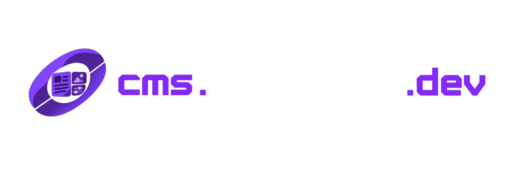

<p align="center">
  
</p>

<p align="center">
  <strong>Content management for okazakee.dev</strong>
  <br />
  <a href="https://cms.okazakee.dev">cms.okazakee.dev</a> &nbsp;·&nbsp; renders
  on the public site <a href="https://github.com/Okazakee/okazakee-ws">okazakee-ws</a>
</p>

---

## Overview

The standalone content management system for
[okazakee.dev](https://okazakee.dev). A Next.js 16 application that authors
the portfolio/blog content stored in a shared Supabase project — sections,
translations, uploads, user management — then notifies the public site to
refresh its caches.

This repository is **write-side only**. It owns editing, auth flows, uploads,
previews and revalidation events; the public website
([Okazakee/okazakee-ws](https://github.com/Okazakee/okazakee-ws)) owns
rendering and caching.

## Highlights

- **Auth** — email/password + GitHub OAuth, gated by an allowlist
  (`cms_allowed_users`: email OR GitHub username) with roles
  `admin` / `editor`
- **Role-based access** — admin: all sections + user management; editor:
  blog/portfolio + account. Every mutation is authorized server-side; the UI
  never is the security boundary
- **Sections** — Hero, Skills, Career, Blog, Portfolio, Contacts, Layout
  (header/footer), Privacy Policy, Users, Account — each with EN/IT
  translations, draft/publish state, and live previews
- **Uploads** — images (client-side WebP preprocessing, server fallback via
  Sharp, SVG rejected) and PDF resumes, stored in the shared `website`
  bucket with format-aware extensions/MIME
- **Consistent limits** — 10 MB for images and PDFs, enforced at every layer:
  client (`useFileUpload` `maxSizeMB`), server validators
  (`MAX_UPLOAD_SIZE_BYTES` in `src/utils/cms/validation.ts`) and the
  framework (`serverActions.bodySizeLimit: '10mb'` in `next.config.ts` —
  without it Next's 1 MB default would reject uploads before the action runs)
- **Cache invalidation** — after a committed mutation the CMS sends a signed
  HTTP event to the public site's `/api/internal/content-revalidate`
  (HMAC-SHA256, replay window, hard-coded tag allowlist)

## Architecture

```text
CMS (this repo) ──writes──▶ Supabase ◀──reads── Public website (okazakee-ws)
       │                        │
       └── signed content-change event ──▶ POST /api/internal/content-revalidate
```

- **Supabase** owns content, auth, storage and the allowlist.
- **This repo** owns editing, auth flows, uploads, previews and revalidation
  events.
- **The public repo** owns rendering and caching (Next Cache Components).
  Revalidation uses `revalidateTag(tag, 'max')` there — never `updateTag()`
  across applications (Server-Action-only).

## Getting Started

### Prerequisites

- Bun 1.3+
- A Supabase project shared with the public site

### Install

```bash
git clone https://github.com/Okazakee/okazakee-cms.git
cd okazakee-cms
bun install
cp .env.local.example .env.local   # then fill in the values below
bun run dev
```

### Environment

See `.env.local.example`. Required:

| Variable | Purpose |
| --- | --- |
| `NEXT_PUBLIC_SUPABASE_URL` | Supabase project URL |
| `NEXT_PUBLIC_SUPABASE_PUBLISHABLE_KEY` | Publishable key (`sb_publishable_…`) |
| `SUPABASE_SECRET_KEY` | Secret key (`sb_secret_…`) — server-only, never in public code |
| `CMS_PUBLIC_URL` | Canonical CMS origin (OAuth callbacks, recovery links) |

Public-site revalidation (production):

| Variable | Purpose |
| --- | --- |
| `WEBSITE_REVALIDATION_URL` | `https://<public>/api/internal/content-revalidate` |
| `WEBSITE_REVALIDATION_SECRET` | Must equal the public site's `CONTENT_REVALIDATION_SECRET` |

### Supabase Setup

**Tables:** `user_profiles`, `cms_allowed_users`, `blog_posts`,
`portfolio_posts`, `skills`, `skills_categories`, `career_entries`,
`contacts`, `hero_section`, `i18n_translations`. **Storage bucket:** `website`.

**Auth redirect URLs** (Supabase Auth → URL Configuration) must include
exactly these canonical paths — the CMS never generates `/cms` callback paths:

- `https://cms.okazakee.dev/en/auth/callback`
- `https://cms.okazakee.dev/it/auth/callback`
- local dev: `http://localhost:3001/en/auth/callback`,
  `http://localhost:3001/it/auth/callback`

Legacy monolith-era entries such as
`https://cms.okazakee.dev/en/cms/auth/callback` (or `/it/…`) are no longer
generated by any flow and can be removed.

**Login rate limiting** — apply the migrations in `supabase/migrations/`:
`cms_check_login_rate` (5 attempts/minute per identifier with a 15-minute
lockout, two independent buckets per-IP and per-email, identifiers stored as
sha256 hashes) plus `cms_clear_login_rate` (resets both buckets after a
successful login). RPC execution is restricted to the service role; stale
rows are purged hourly by a scheduled `pg_cron` job.

> **Rolling deployment (history):** the legacy single-identifier
> `cms_check_login_rate(text)` and its temporary anon/authenticated grant
> were retained until the split-bucket limiter was live, then removed by
> `20260818110000_remove_legacy_login_rate_rpc.sql`. The limiter is now
> service-role only.

## Auth & Account Semantics

- **Login:** allowlist-gated email/password or GitHub OAuth; roles
  `admin` / `editor`. The hidden navigation is never an authorization
  mechanism — every Server Action enforces its role server-side.
- **User management (admin only):** add email users (invite via password
  reset), GitHub users, dummy authors; change roles; remove users. The last
  admin cannot be demoted or removed.
- **"Delete my account"** revokes CMS access: removes the allowlist row and
  the `user_profiles` row, then signs out. It does not delete the Supabase
  Auth identity or historical author attribution.
- **Dummy authors** (`dummy-<uuid>@dummy.local`) are auth users for post
  attribution; removing them also deletes the auth identity.
- **Login rate limiting:** durable Postgres-backed limiter — independent
  per-IP and per-email buckets (5/min, 15-minute lockout), cleared on
  successful login.

## Routes

The CMS serves root paths (no `/cms` prefix):

- `/en`, `/it` — dashboard (redirects to login when unauthenticated)
- `/en/login` — sign-in
- `/en/auth/github/start`, `/en/auth/callback` — GitHub OAuth start/callback

Legacy `/{locale}/cms*` URLs 307-redirect to the equivalent root paths.

### GitHub OAuth

- `/auth/github/start` builds the canonical locale-prefixed callback URL
  (`{origin}/{locale}/auth/callback?next=…`) and starts the provider flow.
- `/auth/callback` finalizes the whole flow in one request boundary: exchanges
  the code, enforces the allowlist (email OR GitHub username, signing out
  unauthorized identities), syncs the CMS profile and redirects directly to
  the canonical `/{locale}` (or a validated same-origin `next`).
- All failure paths land on canonical `/{locale}/login` with a fixed
  user-safe message. No `/auth/ready` hop, no `/cms` routes internally.
- The GitHub username is read from Supabase `user_metadata.user_name`
  (`getUserGithubUsername`).

## Scripts

```bash
bun run dev       # Development server
bun run build     # Production build
bun run start     # Production server
bun run lint      # Biome lint
bun run test      # Vitest
```

## Tests & CI

Unit/integration tests run with Vitest (`bun run test`); suites cover the
cache-tag vocabulary, invalidation descriptors, the mutation result contract,
route matching, validators, auth helpers and the login rate limiter — the
limiter SQL policy is executed against a real (WASM) Postgres via PGlite.

CI (`.github/workflows/ci.yml`, `main` + PRs) runs install → lint → test →
build → typecheck (`bunx tsc --noEmit`).

## Origin

Extracted from `Okazakee/okazakee-ws` at commit `234b064` (2026-08-17) as part
of the CMS decoupling migration. The original repository remains the
historical source of truth.

## License

MIT
