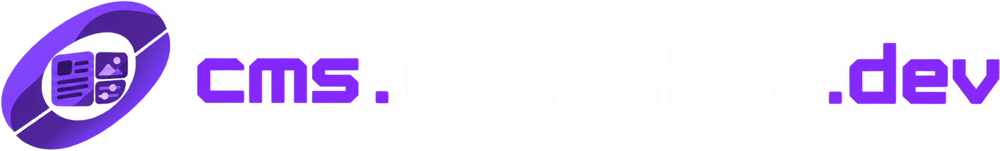

<p align="center">
  
</p>

<p align="center">
  <strong>Content management for okazakee.dev</strong>
  <br />
  <a href="https://cms.okazakee.dev">cms.okazakee.dev</a> &nbsp;·&nbsp; renders
  on the public site <a href="https://github.com/Okazakee/okazakee-ws">okazakee-ws</a>
</p>

---

## Overview

The standalone content management system for
[okazakee.dev](https://okazakee.dev). A Next.js 16 application that authors
the portfolio/blog content stored in a shared Supabase project — sections,
translations, uploads, user management — then notifies the public site to
refresh its caches.

This repository is **write-side only**. It owns editing, auth flows, uploads
and revalidation events; the public website
([Okazakee/okazakee-ws](https://github.com/Okazakee/okazakee-ws)) owns
rendering and caching.

## Highlights

- **Auth** — GitHub OAuth + WebAuthn passkey sign-in (discoverable
  passkeys), gated by an allowlist (`cms_allowed_users`: email OR GitHub
  username) with roles `admin` / `editor`. Email/password login was removed.
- **Role-based access** — admin: all sections + user management; editor:
  blog/portfolio + account. Every mutation is authorized server-side; the UI
  never is the security boundary
- **Sections** — Hero identity/content and portrait; Skills categories and
  ordered entries; Career, Blog and Portfolio entries; ordered Contacts with
  SVG icon URLs; Layout (theme header images + VAT). System groups Resume PDFs, Request Form
  copy, Privacy Policy and Users. Structural section headings, career
  vocabulary and the privacy subtitle live in the website's local EN/IT files.
  Localized entry fields and privacy-policy bodies remain CMS-owned.
- **Publishing** — individual Publish and Publish All require confirmation.
  Publish All confirms once and preserves drafts that fail to commit.
- **Uploads** — images (client-side WebP preprocessing, server fallback via
  Sharp, SVG rejected by image upload validators) and PDF resumes. Production
  uses `website`; staging uses the isolated `website-dev` bucket. Contacts
  render editor-supplied SVG URLs rather than uploading SVG through Sharp.
  Animated WebP skips the
  canvas step and is resized frame-by-frame by Sharp, so animated profile
  pictures keep every frame. BlurHash placeholders are generated with
  [blurkit](https://github.com/Okazakee/blurkit): Sharp handles server-side
  resize/format, Blurkit the placeholder hash (`blurkit/node` on upload,
  `blurkit/browser` client-side)
- **Consistent limits** — 10 MB for images and PDFs, enforced at every layer:
  client (`useFileUpload` `maxSizeMB`), server validators
  (`MAX_UPLOAD_SIZE_BYTES` in `src/utils/cms/validation.ts`) and the
  framework (`serverActions.bodySizeLimit: '10mb'` in `next.config.ts` —
  without it Next's 1 MB default would reject uploads before the action runs)
- **Cache invalidation** — after a committed mutation the CMS sends a signed
  HTTP event to the public site's `/api/internal/content-revalidate`
  (HMAC-SHA256, replay window, hard-coded tag allowlist)

## Layout and System Resume

**Layout** (admin only) owns the two theme header images and the footer VAT
number: `site_settings.header_logo_dark`, `header_logo_light` and
`footer_vat_number`. Each header image is optional and independent — a null one
renders that theme's bundled website image, so clearing one theme never affects
the other. Uploads keep their aspect ratio (bounded, never cropped), use
immutable `header/dark/` and `header/light/` objects in the CMS's selected
bucket, and only take effect after a confirmed Publish; the replaced object is
deleted after the database commit. VAT is nullable `TEXT`: leading zeroes
survive storage, display and copying, and blank input stores `NULL`, which
renders no VAT number on the website — the CMS is the single source, with no
local fallback value. Navigation and the footer name
`Okazakee` are website-owned.

**System → Resume** manages the EN/IT PDFs in `hero_section.resume_en` and
`resume_it`. It uses `heroActions` (`UPDATE_WITH_FILES`) with the existing
10 MB PDF validation and immutable upload → database commit → old-file cleanup
ordering. Publishing a PDF invalidates `resume` and `hero_section`; a combined
portrait/PDF change also invalidates `hero`.

**Hero → Identity & content** edits localized names, ordered roles and the
about paragraph. One nonblank role types once and stops; multiple roles cycle
in order. Blank entries stay editable but do not enter the animation. Portrait
shape remains editable; there are no animation or role-target switches.

Structural Skills, Career, Portfolio, Blog and Contacts copy, along with the
privacy subtitle, lives in `okazakee-ws/src/i18n/messages/site.{en,it}.json`.
The local-over-database merge prevents old rows from overriding those strings.
Category names, entries, links/icons, exact positions and policy bodies remain
editorial data.

User removal requires an identity-specific confirmation. Profile deletion
commits before cleanup of its exact owned avatar URL; external avatars and
wrong-bucket URLs are untouched. Non-public schemas never delete shared Auth
identities.

## Architecture

```text
CMS (this repo) ──writes──▶ Supabase ◀──reads── Public website (okazakee-ws)
       │                        │
       └── signed content-change event ──▶ POST /api/internal/content-revalidate
```

- **Supabase** owns content, auth, storage and the allowlist.
- **This repo** owns editing, auth flows, uploads and revalidation
  events.
- **The public repo** owns rendering and caching (Next Cache Components).
  Revalidation uses `revalidateTag(tag, { expire: 0 })` there — immediate
  expiry for an external caller, so a committed edit is never followed by a
  stale render. `updateTag()` is never used across applications
  (Server-Action-only, unavailable to an incoming HTTP request).

## Getting Started

### Prerequisites

- Bun 1.3+
- A Supabase project shared with the public site

### Install

```bash
git clone https://github.com/Okazakee/okazakee-cms.git
cd okazakee-cms
bun install
cp .env.local.example .env.local   # then fill in the values below
bun run dev
```

### Environment

See `.env.local.example`. Required:

| Variable | Purpose |
| --- | --- |
| `NEXT_PUBLIC_SUPABASE_URL` | Supabase project URL |
| `NEXT_PUBLIC_SUPABASE_PUBLISHABLE_KEY` | Publishable key (`sb_publishable_…`) |
| `SUPABASE_SECRET_KEY` | Secret key (`sb_secret_…`) — server-only, never in public code |
| `CMS_PUBLIC_URL` | Canonical CMS origin (OAuth callbacks, recovery links) |
| `NEXT_PUBLIC_SITE_URL` | Public site origin (asset/link generation) |
| `NEXT_PUBLIC_LOCALES` / `NEXT_PUBLIC_DEFAULT_LOCALE` | Locale list / default (e.g. `en,it` / `en`) |

Public-site revalidation (production):

| Variable | Purpose |
| --- | --- |
| `WEBSITE_REVALIDATION_URL` | `https://<public>/api/internal/content-revalidate` |
| `WEBSITE_REVALIDATION_SECRET` | Must equal the public site's `CONTENT_REVALIDATION_SECRET` |

### Local development: the Development environment

Local values live in the Vercel project's **Development** environment, so a
checkout is configured with `vercel env pull` alone:

| Project | Development values that drive the local loop |
| --- | --- |
| `okazakee-cms` | `WEBSITE_REVALIDATION_URL=http://localhost:3000/api/internal/content-revalidate`, `NEXT_PUBLIC_SUPABASE_DB_SCHEMA=dev_staging` |
| `okazakee-ws` | `CONTENT_REVALIDATION_SECRET` (the same value as the CMS's `WEBSITE_REVALIDATION_SECRET`), `NEXT_PUBLIC_SUPABASE_DB_SCHEMA=dev_staging` |

`vercel env pull` **merges**: keys the pulled environment defines are
overwritten, keys that exist only locally are kept. The hazard is pulling the
*wrong* environment — `vercel env pull --environment=production` overwrites
`WEBSITE_REVALIDATION_URL` with the deployed origin and drops
`NEXT_PUBLIC_SUPABASE_DB_SCHEMA`, so `src/config/shared.ts` falls back to
`public` and local edits are written straight into production content.

**`.env.development.local`** guards against that: Next.js loads it before
`.env.local`, and `next build` / `next start` ignore it.

```bash
# .env.development.local
NEXT_PUBLIC_SUPABASE_DB_SCHEMA=dev_staging
WEBSITE_REVALIDATION_URL=http://localhost:3000/api/internal/content-revalidate
```

`WEBSITE_REVALIDATION_URL` must name the public site you are actually looking
at. With the deployed origin, a local edit signs its invalidation event for
production, the local `okazakee-ws` cache is never purged, and the site keeps
serving the pre-edit render — hero portrait shape, copy, posts — until its own
cache window lapses, which looks exactly like "the CMS value is not used here".

### Supabase Setup

**Tables:** `user_profiles`, `cms_allowed_users`, `blog_posts`,
`portfolio_posts`, `skills`, `skills_categories`, `career_entries`,
`contacts`, `hero_section`, `site_settings`, `i18n_translations`.
**Storage buckets:** `website` in production, `website-dev` otherwise.

`site_settings` is one row: the two theme header image URLs and the textual
VAT number. Header/footer chrome and fixed section copy are not editable
translation namespaces.

**Auth redirect URLs** (Supabase Auth → URL Configuration) must include
exactly these canonical paths — the CMS serves root paths, no `/cms` or
locale prefixes:

- `https://cms.okazakee.dev/auth/callback`
- local dev: `http://localhost:3000/auth/callback`

Legacy monolith-era entries such as
`https://cms.okazakee.dev/en/auth/callback` (or `/it/…`, `/cms/…`) are no
longer generated by any flow and can be removed.

### Database schema: `dev_staging`, never `public`

**`public` holds production content. Local development reads `dev_staging`, a
cloned schema inside the same Supabase project.** Set this before the first
`bun run dev`, or every CMS edit writes straight to production:

```bash
# .env.local
NEXT_PUBLIC_SUPABASE_DB_SCHEMA=dev_staging
```

`src/config/shared.ts` reads that variable and **falls back to `public`** when it
is unset — there is no safe default, so an `.env.local` copied from a Vercel
preview env (which omits it) points at production. Both this app and
`okazakee-ws` must set it for local work to stay off production, and it belongs
in `.env.development.local` so a `vercel env pull` cannot drop it (see
[Local development overrides](#local-development-overrides-envdevelopmentlocal)).

`dev_staging` must also be listed in the project's **exposed schemas**
(Dashboard → Data API settings); otherwise PostgREST answers
`permission denied for schema`.

### Dev database verification: `db:dev:check` (read-only)

Never run a blind `supabase db push`, `migration repair`, or
`search_path`-fallback apply: `public` holds production content and is
off-limits for dev work. The reviewed content cutover
`20261008135608_cms_content_controls_dev_staging.sql` is explicitly
`dev_staging.`-qualified: it migrates singular roles, removes obsolete
animation/logo/name columns and site-owned copy, converts contact SVG URLs
and backfills dense positions. The follow-up
`20261008145842_restore_header_images_dev_staging.sql` re-adds the two
nullable header-image columns that Layout owns. Neither implies a production
schema change.

Link once per machine, then verify (`src/utils/cms/devMigrations.ts`;
`src/libs/cms/devMigrations/devCheck.ts`; registry
`src/libs/cms/devMigrations/registry.json`, 12 `{version,name,sourceFile}`
entries):

```bash
supabase login
supabase link --project-ref <ref>
bun run db:dev:check [--scope dev_staging]
```

That is the only database command. There is no apply command: the CLI
accepts `check` only and rejects any unknown/`apply` action without any DB
writes. Future database changes stay explicitly reviewed/manual — no
automatic apply exists, and there is no pending or interim implementation.
The 7 original public/unqualified historical sources must never be replayed
against the shared project's `public`: the safe manual boundary is to leave
pre-existing `public`/unqualified history alone and change `dev_staging`
only through reviewed SQL + a fresh read-only check.
`--scope` defaults to and must equal `dev_staging`; anything else is an
immediate `FAIL`. The check is read-only (project-local
`supabase db query --linked --output-format json` metadata `SELECT`s plus
local source-file reads; `public` is never queried for certification).

Green check prints `PASS H-<version>` per row (ledger hash == source bytes +
mode), the `C/K/X/P/A/Q` column/constraint/index/policy/ACL findings, the
footer `F` comment statements verbatim, the `D` data-invariant findings, and
ends `dev check: N pass / 0 fail / M info`. Drift fails with exit 1, e.g.
`FAIL H-<v>.hash source DRIFTED… never reapply changed history`,
`FAIL H-<v>.ledger ledger MISSING…`, `FAIL C-/K-/X-/P-/A-/Q-… diverges`,
`FAIL …unregistered…`, `FAIL ledger.read/catalog.read` (with a login/link
hint) — plus the shared-auth NOT-certified note.

Owner knows the development state is good when the check reports `0 fail`
with all 12 `H-<version>` records matching: source bytes immutable, ledger
hash matches, live `dev_staging` effects match. `verified_existing` means
the 93-check audit proved that source's schema effects plus its byte hash —
it does not prove original execution provenance, and it certifies nothing
about `public`, shared auth, or pre-existing history.

Native `supabase_migrations` history is mixed-scope and does not certify
content effects. Dev authority lives in `dev_staging.cms_migration_audit`:
12 records — eight `verified_existing` and four `applied`. The applied
records are the immutable GitHub-subject catch-up (`20261006233000`), Skills
reseed (`20261008122200`), the CMS content-controls cutover
(`20261008135608`) and the dev-only header-image restoration
(`20261008145842`). Live catalog/data checks reflect that latest cutover;
historical source files are never rewritten or replayed against `public`.
Source bytes are immutable: a changed registered file
fails verification, never re-applies. The ledger bootstrap
(`20261005234758_create_cms_migration_audit_ledger.sql`) is dev-only DDL
with its own history row, not one of the audited app records. Baseline (inferred
fixture, not production parity) and shared auth/storage (`auth.users`
sessions carry over, buckets are project-level) stay outside this
certification.
Two things are *not*

- **Storage** — buckets are project-level. Use a separate bucket
  (`website-dev`, selected by `getCmsStorageBucket`) so a test upload cannot land in the live one.
- **Auth** — `auth.users` is shared, so a signed-in browser session carries over
  between schemas; `cms_allowed_users` does not, and must be seeded per schema.

## Auth & Account Semantics

- **Login:** allowlist-gated **GitHub OAuth** or **WebAuthn passkey**
  (discoverable passkeys required); roles `admin` / `editor`. The hidden
  navigation is never an authorization mechanism — every Server Action
  enforces its role server-side.
- **Passkeys:** managed from the Account section (sign-in via
  `window.PublicKeyCredential` platform authenticator; passkeys are
  attachable when supported). A returning user is offered the remembered
  identity from the last successful session.
- **User management (admin only):** add passkey-provisioned users (email
  identifier — no invite email is sent), GitHub OAuth users and dummy
  authors; change roles; remove users through a confirmation modal. The last
  admin cannot be demoted or removed. Owned avatars are cleaned after the
  profile delete commits.
- **"Delete my account"** revokes CMS access: removes the allowlist row and
  the `user_profiles` row, then signs out. It does not delete the Supabase
  Auth identity or historical author attribution.
- **Dummy authors** (`dummy-<uuid>@dummy.local`) are auth users for post
  attribution. Their Auth identity is deleted only when removing them from
  the `public` schema; staging removal cannot cascade production rows.

## Routes

The CMS serves root paths — locale routing was dropped in favor of
client-side language switching:

- `/` — dashboard (redirects to login when unauthenticated)
- `/login` — sign-in (GitHub OAuth + passkey)
- `/auth/github/start`, `/auth/callback` — GitHub OAuth start/callback

Legacy `/{locale}/*` and `/{locale}/cms*` URLs redirect to the equivalent
root paths.

### Auth flows

- **GitHub OAuth** — `/auth/github/start` builds the canonical callback URL
  (`{origin}/auth/callback?next=…`, origin from `CMS_PUBLIC_URL`) and starts
  the provider flow. `/auth/callback` finalizes the whole flow in one request
  boundary: exchanges the code, enforces the allowlist (email OR GitHub
  username, signing out unauthorized identities), syncs the CMS profile and
  redirects directly to `/` (or a validated same-origin `next`). The GitHub
  username is read from Supabase `user_metadata.user_name`
  (`getUserGithubUsername`).
- **Passkey sign-in** — the login page offers a passkey button when the
  browser reports a platform authenticator; sign-in uses discoverable
  credentials and shows passkey-specific error details. Passkeys can be
  added/removed from the Account section.
- All failure paths land on `/login` with a fixed user-safe message. No
  `/auth/ready` hop, no `/cms` routes internally.

## Scripts

```bash
bun run dev       # Development server
bun run build     # Production build
bun run start     # Production server
bun run lint      # Biome lint
bun run test      # Vitest
```

## Tests & CI

Unit/integration tests run with Vitest (`bun run test`); suites cover the
cache-tag vocabulary, invalidation descriptors, the mutation result contract,
route matching, validators and auth helpers.

CI (`.github/workflows/ci.yml`, `main` + PRs) runs install → lint → test →
build → typecheck (`bunx tsc --noEmit`).

## Origin

Extracted from `Okazakee/okazakee-ws` at commit `234b064` (2026-08-17) as part
of the CMS decoupling migration. The original repository remains the
historical source of truth.

## License

MIT